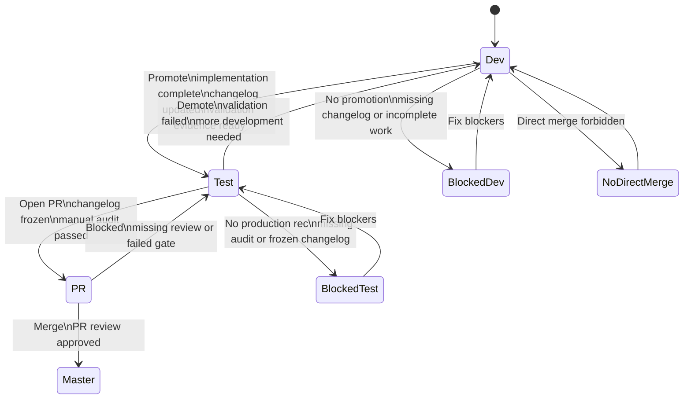

# Odoo Dashboard Branch Governance

## Overview
Apply repository-specific governance for `ODOO-MODULES` where dashboard-created branches move across dev and test states before production merge.
This skill controls branch-state decisions, promotion eligibility, manual audit requirements, and production merge constraints.

## Required Inputs
- Current branch name and current environment state (dev or test).
- Module scope and change summary.
- Validation evidence available for the branch.
- PR status and review status when targeting `master`.

## Workflow
1. Classify branch context.
Use `master` as production-only. Treat every non-master branch as ephemeral and dashboard-managed.
2. Validate environment intent.
In dev, require full module buildout without production data dependency.
In test, require production-data validation and regression checks with production services disabled.
3. Decide branch transition.
Promote `dev -> test` only when module implementation is functionally complete and the affected module changelog is updated.
Demote `test -> dev` when failures require additional development.
4. Enforce production merge policy.
Allow merge to `master` only through PR from a test branch and only when the module changelog is frozen into a versioned release entry.
Reject direct merge paths from dev branch state.
5. Run manual audit gate before production recommendation.
Validate traceability, effectiveness, efficiency, adaptability, and changelog readiness for all modified module code.
6. Use `project-manager` and `product-manager` outputs when promotion depends on explicit readiness, scope, sequencing, or risk tradeoffs rather than raw completion status alone.

## Outputs
- Branch governance decision: stay, promote, demote, or block.
- Explicit gating report with pass/fail criteria.
- Merge eligibility statement for `master`.
- Readiness rationale that can cite project-management or product-tradeoff artifacts when they materially affect the decision.

## Definition of Done
- Branch state decision is explicit and justified.
- Required gates are either passed or documented as blocking items.
- Production merge eligibility is unambiguous.

## Handoff
- If branch stays or is demoted to dev: hand off to implementation planning/execution stages.
- If branch is promoted to test: hand off to validation and UAT stages.
- If branch is eligible for production: hand off to deployment stage and PR finalization.

## Guardrails
- Do not define non-master branch naming constraints.
- Do not bypass test-stage PR review for production merge.
- Do not mark production-ready without manual exhaustive audit.
- Do not assume production services are active in test clones.
- Do not recommend promotion to test or master when the affected module changelog is missing or outdated.

## Related References
- Use `references/manual-audit-checklist.md` for production-readiness review.
- Use `references/module-changelog-policy.md` for changelog gate criteria.
