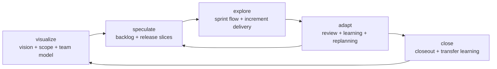
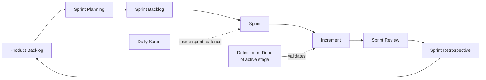

# Odoo Project Management

## Overview
Govern Odoo project delivery as a transversal layer across the lifecycle skills using Agile execution, Lean decision criteria, Kanban flow visibility, and Scrum cadence.
Use this skill when the work needs more than a one-time plan: product vision alignment, prioritized backlog management, sprint-by-sprint control, blocker handling, iterative adaptation, or structured project closure.

This skill is not a lifecycle stage.
It does not replace `odoo-stage-orchestrator`, `odoo-stage-04-planning`, or the `project-manager` subagent.
It coordinates delivery management across them.

## Required Inputs
- Current lifecycle stage and target branch context.
- Current project or module objective.
- Known scope, stakeholders, constraints, and success criteria.
- Existing backlog, sprint status, risks, or feedback when available.
- Delivery horizon: current sprint, release slice, or project closeout.

## Operating Modes
Use one of these modes explicitly:

### `visualize`
- Define product vision, business goal, scope boundaries, stakeholders, constraints, and working agreements.
- Make the delivery model explicit before planning or sprinting begins.
- Use when the team needs a shared project frame or the current work lacks a clear objective model.

### `speculate`
- Build or refresh the product backlog, release slices, priorities, dependencies, and delivery hypotheses.
- Convert strategy into a realistic release plan without pretending certainty.
- Use when planning the next release cycle, ordering features, or deciding what to deliver now versus later.

### `explore`
- Convert prioritized backlog into sprint execution control.
- Define sprint goal, sprint backlog, board flow, blockers, daily coordination focus, and expected increment.
- Use when the team is executing short iterations and needs active delivery management rather than static planning.

### `adapt`
- Review results, inspect the current state, process feedback, and replan.
- Feed sprint review findings, UAT feedback, QA evidence, and retrospective learning back into backlog and next-iteration decisions.
- Use when outcomes differ from expectations or when the next sprint must be adjusted with evidence.

### `close`
- Conclude a release cycle or project with explicit outcome review, residual risks, unresolved debt, and transferable learning.
- Use when the team needs closure rather than open-ended carryover.

## Agile Delivery Model
Apply the project through these five Agile lenses:
1. Visualization: determine product vision, scope, stakeholders, and team working model.
2. Speculation: define release intent, backlog, priorities, dependencies, and delivery hypotheses.
3. Exploration: deliver useful increments in short cycles while reducing risk.
4. Adaptation: inspect results, absorb learning, and replan based on evidence.
5. Closure: conclude the cycle and transfer usable learning to the next one.

## Lean Decision Criteria
Apply Lean thinking in every mode:
- Eliminate work that does not add customer value.
- Reduce delays, handoff waste, interruptions, and rework.
- Surface failures early instead of carrying hidden defects forward.
- Prefer smaller, validated increments over speculative bulk delivery.
- Seek quality and process improvement continuously, not only at the end.

## Kanban Flow Rules
Use Kanban as the default visualization and flow-control mechanism:
- Visualize current work, next work, blocked work, and done work.
- Respect the current operating model unless there is evidence for change.
- Prefer incremental, evolutionary process change over disruptive redesign.
- Make blockers and queue buildup explicit.
- Use WIP awareness when parallel work is hurting flow or predictability.

## Scrum Operating Model
Use Scrum as the default cadence for iterative delivery when the work is sprint-based.

### Scrum Artifacts
- `Product Backlog`
  - Ordered inventory of features, stories, risks, improvements, and release work.
  - Inputs: product vision, scope, dependencies, stakeholder needs, current findings.
  - Output: prioritized backlog aligned to business value, risk, and delivery sequencing.

- `Sprint Backlog`
  - Sprint-level commitment selected from the product backlog, including process improvements carried from retrospective when relevant.
  - Inputs: prioritized backlog, sprint goal, team capacity, dependencies, current blockers.
  - Output: sprint scope, execution tasks, blocker watchlist, and sprint-level traceability.

- `Increment`
  - Usable, evidence-backed result produced during the sprint and aligned with the active stage Definition of Done.
  - Inputs: completed sprint backlog items, validation evidence, changelog impact, known limitations.
  - Output: demonstrable increment ready for review, QA/UAT progression, or release decision as appropriate.

### Scrum Events
- `Sprint Planning`
  - Purpose: select backlog items, define sprint goal, agree on the work needed for the next iteration.
  - Inputs: product backlog, priorities, team capacity, dependencies, risks.
  - Output: sprint goal, sprint backlog, initial flow view, and explicit assumptions.

- `Sprint`
  - Purpose: execute a fixed iteration focused on delivering a usable increment.
  - Inputs: sprint backlog and sprint goal.
  - Output: updated board state, blocker log, execution evidence, and increment progress.

- `Daily Scrum`
  - Purpose: synchronize the next 24 hours of work for the delivery team.
  - Inputs: current sprint status, blockers, in-flight work.
  - Output: next-day coordination updates, blocker escalation, and flow adjustments.

- `Sprint Review`
  - Purpose: inspect the increment with stakeholders and gather delivery feedback.
  - Inputs: increment, QA/UAT findings, stakeholder observations, accepted scope.
  - Output: review findings, acceptance feedback, backlog updates, and release implications.

- `Sprint Retrospective`
  - Purpose: inspect the team process and commit improvement actions for the next iteration.
  - Inputs: sprint outcomes, blocker patterns, review feedback, process observations.
  - Output: concrete improvement actions that feed the next sprint backlog or working agreements.

## Workflow
1. Identify whether the current need is vision framing, backlog shaping, sprint execution, adaptation, or closure.
2. Select the matching mode: `visualize`, `speculate`, `explore`, `adapt`, or `close`.
3. Pull the relevant template from `references/` and populate it with repo-specific evidence.
4. Align outputs with the active lifecycle stage instead of bypassing it.
5. Make the next handoff explicit: stage continuation, backlog update, sprint continuation, review input, or project closure.

## Outputs
- Product vision and working model.
- Prioritized product backlog and release slice plan.
- Sprint goal, sprint backlog, board view, and blocker log.
- Review and retrospective package with adaptation decisions.
- Closeout summary with residual risk, learning, and next-cycle seeds.

## Definition of Done
- The requested project-management mode is explicit and matched to the current lifecycle need.
- Backlog, sprint, review, or closure outputs are concrete enough to guide the next action.
- Lean waste, Kanban flow visibility, and Scrum cadence are reflected in the produced artifact, not only mentioned.
- The next lifecycle handoff or decision is explicit.

## Handoff
- Hand off to `odoo-stage-orchestrator` when the next lifecycle stage must still be selected.
- Hand off to `odoo-stage-04-planning` when vision and backlog are ready to become an executable implementation plan.
- Hand off to `odoo-stage-06-implementation` when sprint execution control is ready and coding work should begin or continue.
- Hand off to `odoo-stage-07-validation-qa` or `odoo-stage-08-uat` when the increment needs formal review inputs and acceptance evidence.
- Hand off to `odoo-stage-10-maintenance` or back to `odoo-stage-01-discovery` when closure learnings should seed the next cycle.

## Related References
- Use `references/vision-and-working-model-template.md` for `visualize`.
- Use `references/backlog-and-release-template.md` for `speculate`.
- Use `references/sprint-management-template.md` for `explore`.
- Use `references/review-retrospective-template.md` for `adapt`.
- Use `references/project-closeout-template.md` for `close`.
