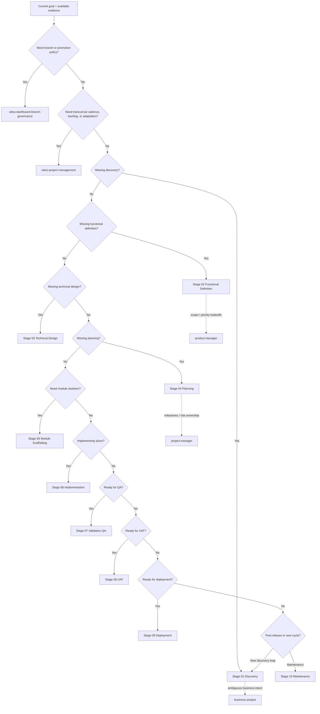

# Odoo Stage Orchestrator

## Overview
Decide which lifecycle stage applies to the current Odoo custom module work, validate stage prerequisites, and align the handoff between stage-specific skills.
Use this skill to coordinate the 10 stage skills as one coherent delivery system, not as isolated documents.

## Required Inputs
- Current branch context and environment state (`dev`, `test`, or `master`-targeting PR context).
- Current module status or known artifacts already produced.
- Explicit user objective for the current turn.
- Known blockers, audit findings, or unresolved decisions.

## Workflow
1. Classify the current work against the lifecycle stages.
2. Identify the latest completed valid stage based on available artifacts and evidence.
3. Check whether the requested action matches the next valid stage or requires a fallback.
4. Route to the correct stage skill and state the required inputs, missing evidence, and expected outputs.
5. Prevent invalid jumps unless the user explicitly requests a controlled exception and the risk is documented.

## Stage Decision Tree
Use these stage skills in order:
- `odoo-stage-01-discovery`
- `odoo-stage-02-functional-definition`
- `odoo-stage-03-technical-design`
- `odoo-stage-04-planning`
- `odoo-stage-05-module-scaffolding`
- `odoo-stage-06-implementation`
- `odoo-stage-07-validation-qa`
- `odoo-stage-08-uat`
- `odoo-stage-09-deployment`
- `odoo-stage-10-maintenance`

## Alignment Rules
- In `dev`, default to stages 01 through 06 unless there is explicit validation evidence for later stages.
- In `test`, default to stages 07 through 08 and only continue to stage 09 when audit and UAT conditions are satisfied.
- For `master`, allow only production-oriented review and deployment decisions sourced from a reviewed test branch.
- Do not treat branch name as stage; use artifacts and evidence to decide actual lifecycle position.
- Use `odoo-dashboard-branch-governance` when branch-state or promotion policy is part of the decision.
- Use `odoo-project-management` when the work needs product vision alignment, backlog governance, sprint cadence, flow visualization, iterative adaptation, or formal project closure learning.
- Stage 01 through 02 may use `business-analyst` when business intent, assumptions, or scope are not yet stable.
- Stage 02 through 04 may use `product-manager` when prioritization, release intent, or scope tradeoffs materially affect the next handoff.
- Stage 04 and governance decisions may use `project-manager` when sequencing, readiness, milestones, or risk ownership need explicit coordination.

## Outputs
- Selected lifecycle stage and why it is the correct one.
- Required inputs and missing prerequisites for that stage.
- Expected output artifact of the selected stage.
- Clear handoff target for the next stage.

## Definition of Done
- Current lifecycle position is explicit and justified.
- Missing prerequisites are identified without ambiguity.
- The selected stage and next handoff are aligned with repository workflow.

## Handoff
- Route execution to the selected `odoo-stage-XX-*` skill.
- Route branch-state concerns to `odoo-dashboard-branch-governance`.
- Route technical implementation questions to `odoo-19` after stage selection is clear.
- Route transversal Agile, Lean, Kanban, and Scrum delivery management to `odoo-project-management` when execution control spans multiple stages or iterations.
- Route business clarification to `business-analyst`, product tradeoffs to `product-manager`, and planning/readiness structuring to `project-manager` when stage artifacts need those perspectives.
